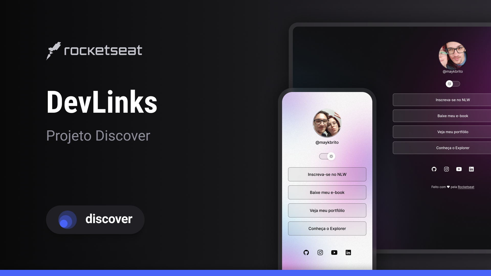

<h1 align="center">
  dev.finance<strong style="font-size:24px; color:green;">&dollar;</strong>
</h1>

<p align="center">
  <a href="#-tecnologias">Tecnologias</a>&nbsp;&nbsp;&nbsp;|&nbsp;&nbsp;&nbsp;
  <a href="#-projeto">Projeto</a>&nbsp;&nbsp;&nbsp;|&nbsp;&nbsp;&nbsp;
  <a href="#-usar">Usar</a>&nbsp;&nbsp;&nbsp;|&nbsp;&nbsp;&nbsp;
  <a href="#memo-licença">Licença</a>
</p>

<p align="center">
 
  
</p>

<p align="center">
  
</p>

## 🚀 Tecnologias

Esse projeto foi desenvolvido com as seguintes tecnologias:

- HTML
- CSS
- JavaScript
- Git

## 💻 Projeto

é uma aplicação onde teremos Varios links junto com um sistema de tema escuro e tema claro

## Usar

Para iniciar o projeto execute o comando, para baixar todas as dependências necessárias:

```bash
npm install
```

Após a instalação das dependências o projeto está pronto para ser executado na sua máquina local usando:

```bash
npm run dev
```

Para visualizar a aplicação vá para **localhost:3000** no seu navegador e o projeto deve ser exibido.

Feito com ♥ by allan moura & Rocketseat :wave:
